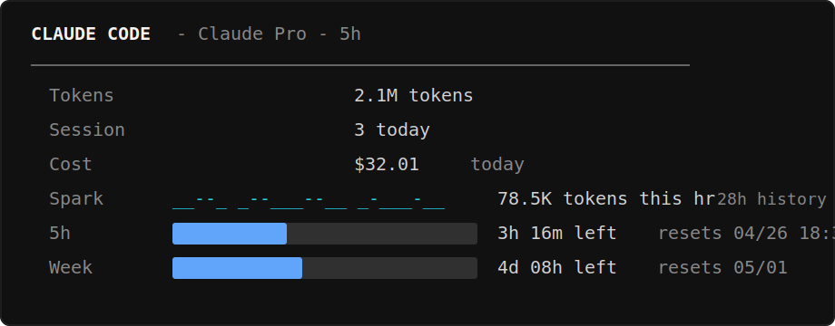

# vbi-cli

Local-first terminal dashboard for AI CLI usage. Reads local usage records that AI CLIs already write; credential values, prompts, and message bodies are not extracted, and provider APIs are not called for usage collection.

## Introduction

AI tooling quickly becomes hard to track: different assistants have their own CLIs, MCP servers, connectors, editor extensions, accounts, usage limits, reset windows, and billing signals. It is easy to forget what is installed, which tool is connected where, and which quota or plan is currently shaping your work.

vbi-cli gives that sprawl a local terminal view so you can choose the right tool for the task, plan around token and time limits, and keep experimenting with new AI tools without losing track of the machine you are actually using.

Example map output:

```text
machine
├─ Claude Code
│  ├─ CLI: claude
│  └─ MCP: filesystem, github
├─ Codex CLI
│  ├─ CLI: codex
│  └─ MCP: configured servers
├─ VS Code
│  └─ Extensions: ChatGPT, Copilot
└─ Connectors
   ├─ GitHub
   └─ Google Drive
```

## Purpose

vbi-cli helps developers inspect AI CLI usage before they hit plan, context, rate-limit, or budget surprises. It is designed for people using multiple AI coding tools who want one terminal view of local usage signals without sending data to a VBI server.

It also helps users quickly understand which AI tools are installed, detected, and connected on the machine.

The inventory and map views bring MCP servers, CLIs, connectors, and editor extensions into one clear machine-level map.

Because `vbi export` writes sanitized JSON, vbi-cli can also feed automation scripts that decide when to pause, resume, switch tools, or schedule work around token, context, rate-limit, and reset-time windows.

vbi-cli is designed to use very little machine resource: it runs as a terminal process, stores small JSON cache records, and does not run a background service. `status` and `dashboard` read cache only; `live` and `sync` scan local usage files, so their cost depends on how much local CLI history exists.

## Install

Requires Python 3.10+.

Windows / PowerShell:

```powershell
pwsh -NoLogo -NoProfile -ExecutionPolicy Bypass -File .\install.ps1
```

Run the installer from the extracted or cloned repo folder. If pip has no cached wheels, dependencies are downloaded from PyPI into the local virtual environment under the install target.

Typical Windows / PowerShell install time is about 25-45 seconds on this release build. Network speed, pip cache state, and antivirus scanning can move that number. The installer writes pip diagnostics to `install-pip.log` inside the install target.

Developer install:

```bash
pip install -e .
```

## First Run

```bash
vbi live
```

The installer drops you into the interactive `vbi>` prompt. Useful first commands:

```text
live
status
inventory
map
audit
exit
```

You can also run commands directly:

```bash
vbi live              # continuous, refresh every 10s (Ctrl+C to exit)
vbi live --once       # one-shot snapshot
vbi live --interval 30
vbi status            # cached records only
vbi inventory         # discover installed AI tooling
vbi map               # host-first tooling map
vbi doctor runtime    # scan duplicate MCP / Node / Python runtimes
vbi cleanup           # dry-run duplicate runtime report (lists group signatures)
vbi cleanup --apply   # stop older duplicates, keep the newest in each group
vbi cleanup --apply --groups "mcp:*"    # only target MCP groups (glob filter)
vbi audit             # GitHub release safety scan
vbi export            # write sanitized JSON report to ~
```

`vbi export` writes a JSON report that can be consumed by other CLI tools or downstream AI workflows for further analysis and automation.

`vbi cleanup --apply` keeps the newest process in each duplicate group (by start time, ties broken by highest PID) and terminates the rest. It prompts for confirmation unless `--yes` is passed. Use `--groups <patterns>` (comma-separated fnmatch globs) to limit the targets — for example, `--groups "mcp:*"` cleans only stale MCP servers and leaves long-running Node helpers (extension hosts, SDK daemons) alone. Run `vbi cleanup` first to see the duplicate group signatures.

## Example CLI Session

```text
PS> vbi status
record_id | source_type | confidence | status
claude-code-cli | local_telemetry | medium | ok
codex-cli | local_telemetry | medium | ok
gemini-cli | local_telemetry | low | ok

PS> vbi export
  ✓ report written: ~/vbi-report-20260501.json
  4 tier1 · 0 tier2 · 3 providers · 0 audit findings · paths sanitized to ~
```

Sample `vbi live` frame:



## Supported providers

| Provider | What's shown | Trigger required |
| --- | --- | --- |
| **Antigravity** (Google AI Pro/Ultra) | Plan, AI credits, monthly subscription requests, hourly rate-limit, Month reset | None — extension auto-writes SQLite + cloudcode.log |
| **Claude Code** | Tokens today, cost (estimated), sessions, hourly spark, 5h + Week reset | 5h/Week reset bars require running `/usage` inside Claude Code |
| **Codex CLI** (ChatGPT Plus/Pro) | Context tokens vs window, plan, subscription expiry, 5h + Week reset, quota % | None — every API call writes `rate_limits` to session JSONL |
| **Gemini CLI** | Session count today | No quota data — Gemini CLI doesn't log token usage locally |
| **OpenCode** | Session counts and configured provider names | No token/quota data — credential values are not read |

## Limits

- Gemini CLI does not expose local token/quota data, so `vbi` reports session activity only.
- Claude Code 5h / Week reset bars require running `/usage` inside Claude Code first.
- Cost values derived from local usage records are estimates, not official billing.

## Privacy

- Provider usage collection reads local files and writes only VBI-owned cache records under `~/.vbi/cache/`.
- Credential values are not extracted. Some adapters may read non-secret metadata from local auth files, such as `auth.json` JWT body claims for plan/expiry; signing keys and token values are not used or exported.
- No transcript content, no message bodies, no prompts are exported.
- No provider API calls are made for usage collection.
- `vbi export` writes a sanitized JSON report to `~` by default.
- `vbi update` and the startup update hint may run `git fetch`.

## Disclaimer

vbi-cli is provided as-is, without warranty. It reports best-effort local usage signals and estimates; it is not an official billing, quota, security, or compliance authority.

Users are responsible for reviewing exported reports before sharing them, securing their own machine and home directory, and deciding how to use any automation built on top of `vbi export`.

vbi-cli should not be used as the sole control for high-risk, financial, security-critical, or production automation decisions.

## Attribution

vbi-cli was originally created by CLUSTER & Associates. Forks and modified versions should preserve the original copyright and license notice, and should not imply that modified versions are the original upstream project unless they are released by the original maintainers.

## Data Contract

Each adapter has a strict documented contract about what is automatic vs. trigger-required. The contract is enforced in code: adapters do not probe provider APIs to fill gaps, and missing data is surfaced honestly with a hint when a manual trigger is required.

## Developer Notes

Read [`docs/PROVIDER_ADAPTERS.md`](docs/PROVIDER_ADAPTERS.md) and [`docs/DATA_CONTRACT.md`](docs/DATA_CONTRACT.md). Each provider in `vbi/providers/` is a 200–400 line file with a documented data-collection contract at the top.
